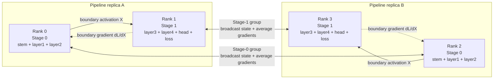
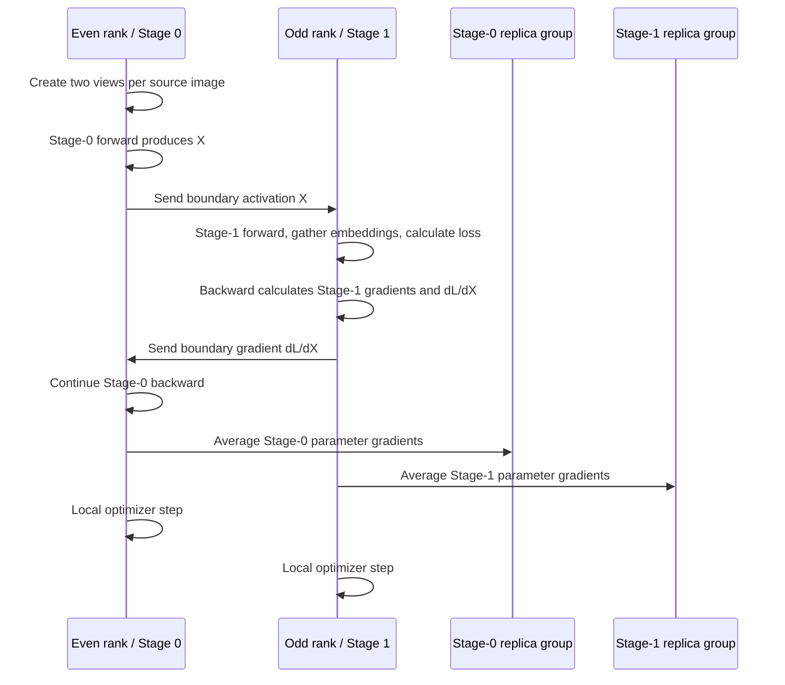

# Manual two-stage distributed training capstone

This project trains a ResNet18-based encoder on deterministic synthetic images.
It manually splits the model across two pipeline stages and replicates that
pipeline across four `torch.distributed` ranks. The learning objective is
SimCLR-like; the project evaluates distributed-systems behavior rather than
embedding quality.

## Architecture

- Rank 0: Stage 0 replica A
- Rank 1: Stage 1 replica A and local contrastive loss
- Rank 2: Stage 0 replica B
- Rank 3: Stage 1 replica B and local contrastive loss
- Pair groups `(0, 1)` and `(2, 3)` transfer boundary activations and gradients.
- Stage-0 group `(0, 2)` and Stage-1 group `(1, 3)` broadcast initial state and
  average corresponding parameter gradients.

Stage 0 contains the ResNet stem, `layer1`, and `layer2`. It produces a boundary
activation shaped `N×128×28×28`. Stage 1 contains `layer3`, `layer4`, average
pooling, flattening, and a projection head that produces 128-dimensional
embeddings.



One training step follows this sequence:



## Setup

Open the `Distributed_DL` devcontainer, then activate its environment:

```bash
conda activate 22971-td
cd /workspace
```

No data-preparation command is required. `torchvision.datasets.FakeData`
generates deterministic ImageNet-shaped source images in memory. The training
script creates two random augmented views from each source image.

## Run

Initialization smoke tests:

```bash
torchrun --standalone --nproc_per_node=4 \
  6_torch_dist_capstone_project/setup_comm_groups.py

torchrun --standalone --nproc_per_node=4 \
  6_torch_dist_capstone_project/setup_model_stages.py
```

Baseline profiled run:

```bash
torchrun --standalone --nproc_per_node=4 \
  6_torch_dist_capstone_project/train_pipeline.py \
  --steps 3 \
  --local-batch-size 2 \
  --profiler \
  --output-dir 6_torch_dist_capstone_project/artifacts/batch2
```

Follow-up profiled runs:

```bash
torchrun --standalone --nproc_per_node=4 \
  6_torch_dist_capstone_project/train_pipeline.py \
  --steps 3 \
  --local-batch-size 4 \
  --profiler \
  --output-dir 6_torch_dist_capstone_project/artifacts/batch4

torchrun --standalone --nproc_per_node=4 \
  6_torch_dist_capstone_project/train_pipeline.py \
  --steps 3 \
  --local-batch-size 8 \
  --profiler \
  --output-dir 6_torch_dist_capstone_project/artifacts/batch8
```

Summarize the named profiler spans:

```bash
python 6_torch_dist_capstone_project/summarize_traces.py \
  6_torch_dist_capstone_project/artifacts/batch2

python 6_torch_dist_capstone_project/summarize_traces.py \
  6_torch_dist_capstone_project/artifacts/batch4

python 6_torch_dist_capstone_project/summarize_traces.py \
  6_torch_dist_capstone_project/artifacts/batch8
```

Load any `trace_rank*.json` file into `chrome://tracing` or Perfetto to inspect
the timeline.

## Training and communication flow

1. Even ranks create two augmented views per source image.
2. Stage 0 runs forward and sends a detached boundary activation to its paired
   odd rank.
3. The odd rank receives the activation into a fresh tensor, enables gradient
   tracking, and runs Stage 1.
4. Odd ranks gather detached embeddings from the other Stage-1 replica while
   retaining their own live embeddings.
5. Each odd rank computes loss for its local views against all gathered
   embeddings.
6. Stage 1 runs backward and sends `dL/dX`, the boundary-activation gradient,
   to its paired even rank.
7. Stage 0 continues backward using the returned gradient.
8. Corresponding stage replicas average parameter gradients.
9. Each rank's local SGD optimizer updates its owned stage parameters.

## Loss approximation

For each local embedding, all other global embeddings are candidate classes.
The matching augmented view is the correct class, cosine similarities divided
by temperature are logits, and the query itself is masked. Cross-entropy asks
the positive view to receive the strongest score.

The global softmax couples gradients across views, but low-level
`dist.all_gather` does not preserve a cross-rank autograd graph. Each odd rank
therefore computes loss only for its local live embeddings. Remote gathered
embeddings are treated as fixed values. This is an intentional approximation
that keeps the capstone focused on explicit distributed communication.

## Profiling and tuning result

Each rank exports a Chrome trace containing the required named spans. Rank 0
also saves `metrics.csv` and `run_config.json`. `summarize_traces.py` creates a
compact span summary.

Ignoring the first warmup step (DevContainer):

- Local batch 2, global batch 4: 3.47 images/s
- Local batch 4, global batch 8: 3.68 images/s
- Local batch 8, global batch 16: 3.72 images/s

Selected configuration: local batch size 8, which maximizes measured
`images/s`. Absolute numbers are low because four CPU ranks contend in the
container, and returns diminish: step time roughly scales with batch size, so
throughput barely rises. The systems finding is clearer in the traces than in
the images/s delta: Stage 0 is heavier, odd ranks wait in `recv_boundary`, and
even ranks later wait in `recv_boundary_grad`. Direct send spans stay tiny. See
`artifacts/diagnosis.md` and `artifacts/sweep_summary.csv`.

To inspect all ranks together in Perfetto, open:

```text
6_torch_dist_capstone_project/artifacts/batch8/trace_combined.json
```

## Demo checklist

For the video:

1. Show `build_stage0`, `build_stage1`, and the communication groups.
2. Show boundary `send`/`recv` and returned-gradient `send`/`recv`.
3. Show embedding gather, approximate contrastive loss, and gradient averaging.
4. Run the batch-2 command.
5. Open one trace and identify compute, transfer, synchronization, and blocking
   receive spans.
6. Show `sweep_summary.csv` and explain the batch-8 decision.
7. Compare batch-2, batch-4, and batch-8 throughput and waiting patterns.
