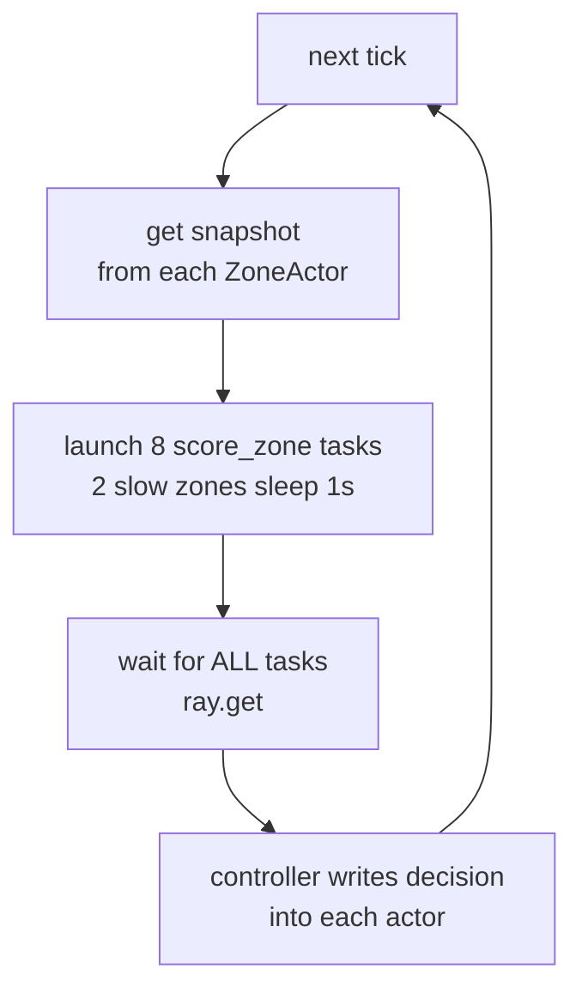
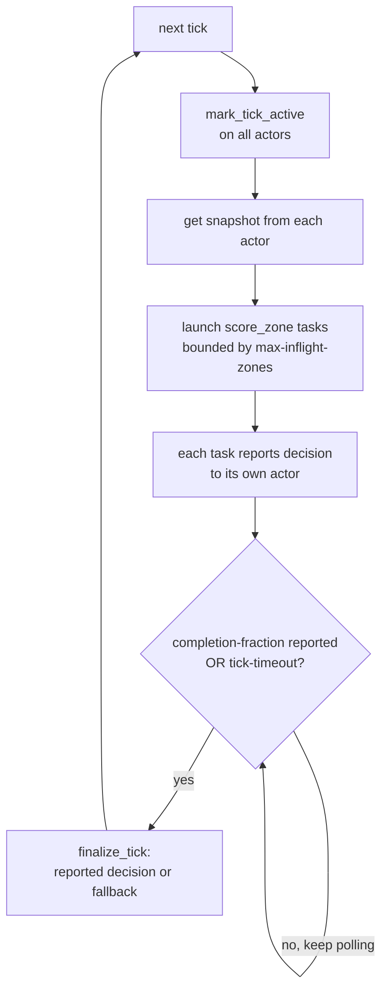

# Ray Capstone: Per-Zone Demand Recommendations

Tick-based replay of NYC TLC Green Taxi demand. One Ray **actor per zone** owns
that zone's state; stateless scoring **tasks** compare current demand to a
baseline and emit a `NEED` / `OK` recommendation. The project contrasts a
**blocking** controller (wait for all zones) with an **asynchronous** controller
(tasks report straight to actors; the driver closes ticks under a
partial-readiness policy), and shows how the async path tolerates stragglers.

Built and pinned for **Python 3.14 + Ray 2.55.1** (see `requirements.txt`).

## Setup

```bash
python -m venv .venv
source .venv/bin/activate
pip install -r requirements.txt
```

## Prepare the assets

This is the design doc's **data-preprocessing / Step B** stage, kept as a
separate `prepare` step so the runtime consumes prepared tables instead of raw
parquet. The **reference month (Nov)** teaches the system what "normal" looks
like; the **replay month (Dec)** is the time-ordered stream we walk through.

```bash
python main.py prepare \
  --reference-parquet ../TLC_Data/green_tripdata_2025-11.parquet \
  --replay-parquet ../TLC_Data/green_tripdata_2025-12.parquet \
  --output-dir prepared \
  --n-zones 8
```

What each part does, and why:

1. **Load + clean each month** (`load_and_clean_month`). Reads only the two
  columns we need (`lpep_pickup_datetime`, `PULocationID`) and **drops every row
   whose pickup timestamp does not fall in the file's dominant calendar month.**
   TLC monthly files contain a handful of stray/garbage timestamps (a few seconds
   into the next month, or clearly wrong years); trimming them keeps tick indexing
   and baselines honest.
2. **Validate adjacency** (`validate_adjacent_months`). Enforces the design-doc
  rule that the two files are **adjacent months in the same year** (Nov -> Dec
   ok; Dec -> Jan rejected). The baseline is only meaningful if it sits right
   before the replay month.
3. **Select active zones** (`select_active_zones`, `--n-zones`). Picks the
  **busiest pickup zones in the reference month**, ranked by total pickups with
   ties broken by lowest `zone_id` so the choice is **deterministic** for the same
   inputs/seed (a design-doc requirement). We use the busiest zones because they
   have dense data in almost every `(hour, day_of_week)` slot, so their baselines
   are well-populated and the `current / baseline` ratio is stable. A rarely-used
   zone would have many empty slots and a near-zero baseline, making the ratio
   noisy or undefined. **8** is a deliberate trade-off: large enough to show
   cross-zone skew and uneven completion, small enough that all zones (one actor
   each) fit on the 12-CPU Docker cluster so the slow zones' scoring tasks run in
   parallel rather than serializing on too few CPUs.
4. **Build the baseline table** (`build_baseline_table`). Collapses the reference
  month into **mean pickups per 15-min window, keyed by `(zone_id, hour_of_day,  day_of_week)`** - the "normal demand" reference. Note the grain is hour+weekday,
   not tick, so e.g. all four 15-min windows in the 08:00 hour share one baseline.
5. **Build the replay table** (`build_replay_table`). Aggregates the replay month
  into **one row per `(zone_id, tick)`**, where `tick` is a global 15-min index
   anchored at the month's first window (so the same `tick_id` is the same
   wall-clock window for every zone). Windows with zero pickups are simply absent
   and treated as zero demand at runtime.
6. **Cross-check** (`crosscheck_replay`). The design doc's required pandas
  validation: it re-counts a few **seeded random** `(zone, tick)` windows directly
   from the cleaned rows and asserts they match the prepared replay counts exactly
  - catching any bug in the multi-step aggregation. Prints `cross-check passed`.
7. **Write assets** (`write_assets`). Persists
  `prepared/{baseline.parquet, replay.parquet, metadata.json}`. `metadata.json`
   carries the facts the runtime cannot recompute: `active_zones`, `n_ticks`,
   `tick_minutes`, the two months, and the `seed`.

## Run locally

These are the design doc's **three required demo runs** on the same replay data,
so the only variable is the execution strategy. Skew is simulated by injecting an
artificial `time.sleep` into a deterministic subset of "slow" zones
(`--slow-zone-fraction` / `--slow-zone-sleep-s`); e.g. `0.25 * 8 = round(2.0) = 2` slow zones, the same 2 every run (seeded). Each use case shows a **local**
command and the **cluster** equivalent via `docker/submit.sh` (which auto-fills
`--prepared-dir` / `--output-dir` / `--mode`). The cluster variant assumes the
cluster is up: `docker compose -f docker/docker-compose.yml up -d --build`.

### Decision rule (NEED / OK)

Shared by all three modes. For each `(zone, tick)`:
`current_pickups / baseline_pickups >= need-threshold` (default `1.1`, i.e. demand
at least 10% above the normal profile for that zone's `(hour_of_day, day_of_week)`
slot) emits `NEED`, otherwise `OK`. A non-positive baseline is guarded -> `OK`.

### 1. Blocking baseline

The controller waits for **all** zone tasks each tick, so tick latency tracks the
**slowest** zone (~1s) and skew hurts visibly. The controller owns the write back
into each actor.




```bash
# local
python main.py run --prepared-dir prepared --output-dir runs/blocking \
  --mode blocking --start-tick 32 --max-ticks 48 --slow-zone-fraction 0.25 --slow-zone-sleep-s 1.0

# on the cluster (same run via ray job submit)
docker/submit.sh blocking --start-tick 32 --max-ticks 48 \
  --slow-zone-fraction 0.25 --slow-zone-sleep-s 1.0
```

### Partial-readiness policy (async)

Per tick the driver submits scoring tasks with bounded concurrency
(`--max-inflight-zones`), then polls actor readiness. It closes the tick as soon
as `--completion-fraction` of zones have reported, or when `--tick-timeout-s`
elapses, whichever comes first. Zones that have not reported are finalized with
the fallback policy `previous_else_ok`: reuse the zone's previous accepted
decision, or `OK` on first use. Late/duplicate/inactive reports after close are
rejected and counted (`late_reports`, `duplicate_reports`).

> **Note on the fallback default (deviation from the design doc).** The design doc
> states `fallback_policy` should default to `always_previous` (lines 278, 365),
> but the code defaults to `previous_else_ok`. These differ only in the **first-use
> edge case**: `always_previous` is undefined for a zone that has no prior accepted
> decision yet (tick 0), so `previous_else_ok` resolves that case explicitly by
> emitting `OK`. The design doc itself requires students to "choose, implement, and
> document a consistent first-use edge-case policy" (line 366), so this is that
> documented choice rather than a behavioral conflict. (This predates the current
> work and was left untouched; it can be reconciled separately if a strict
> `always_previous` name is required.)

### 2. Async controller

Tasks **report their own decision straight to their actor**; the driver polls
readiness and closes the tick once `--completion-fraction` of zones report **OR**
`--tick-timeout-s` expires (late zones get the fallback). Tick latency is bounded
by the timeout, not the slowest zone.




```bash
# local
python main.py run --prepared-dir prepared --output-dir runs/async \
  --mode async  --start-tick 32 --max-ticks 48 --slow-zone-fraction 0.25 --slow-zone-sleep-s 1.0 \
  --completion-fraction 0.75 --tick-timeout-s 2.0

# on the cluster (same run via ray job submit)
docker/submit.sh async --start-tick 32 --max-ticks 48 \
  --slow-zone-fraction 0.25 --slow-zone-sleep-s 1.0 \
  --completion-fraction 0.75 --tick-timeout-s 2.0
```

### 3. Skew stress test

Same async control loop as above, but `stress` **escalates the skew internally**
(forces `slow-zone-fraction >= 0.5` and `slow-zone-sleep-s >= 3.0`). The point is
the contrast: a blocking run under these settings would degrade sharply (every
tick waits ~3s for the slowest), while the async controller still progresses
cleanly by falling back on the many late zones.

```bash
# local
python main.py run --prepared-dir prepared --output-dir runs/stress \
  --mode stress --start-tick 32 --max-ticks 48

# on the cluster (same run via ray job submit)
docker/submit.sh stress --start-tick 32 --max-ticks 48
```

Compare `runs/blocking/metrics.csv` vs `runs/async/metrics.csv`: under the same
skew, blocking's mean tick latency tracks the slow-zone sleep, while async stays
bounded by the timeout (at the cost of more fallbacks).

**Make the gap obvious (matched harsh skew).** On the 12-CPU cluster the 2 slow
zones already run in parallel, so blocking tick latency equals a single slow-zone
sleep (~1s), and async (quorum `ceil(0.75 x 8) = 6`, exactly the 6 fast zones)
closes without waiting for either straggler - so async already edges out blocking
in the mild config. To make the contrast unmistakable and exercise the timeout
path explicitly, raise the sleep so **blocking** clearly suffers and lower the
timeout so **async** stays bounded, running both under identical skew
(4 slow / 4 fast zones, 3s stalls):

```bash
# blocking under harsh skew -> every tick waits ~3s for the slowest zone
RUN_LABEL=blocking_harsh docker/submit.sh blocking --start-tick 32 --max-ticks 48 \
  --slow-zone-fraction 0.5 --slow-zone-sleep-s 3.0

# async under the SAME skew, but timeout (1s) < sleep (3s) and a low quorum ->
# closes on the fast zones, falls back the 4 slow ones, ~1s per tick
RUN_LABEL=async_harsh docker/submit.sh stress --start-tick 32 --max-ticks 48 \
  --tick-timeout-s 1.0 --completion-fraction 0.5
```

(`stress` already forces `slow-zone-fraction>=0.5` and `slow-zone-sleep-s>=3.0`,
so the async command inherits the same skew as the blocking one.) Expect
`runs/blocking_harsh` mean tick latency ~3s (all 4 slow zones run in parallel, so
it is one sleep, not four) vs `runs/async_harsh` ~1s, with `async_harsh` showing
~4 fallbacks/tick - the latency win is paid for in staler decisions on the late
zones. Swap `docker/submit.sh` for the local
`python main.py run ...` form to run the same pair without the cluster.

## Tests (fault-tolerance invariants)

```bash
python -m pytest test_invariants.py -v
```

Covers idempotent writes and rejection of duplicate, late, and inactive-tick
reports, plus the `previous_else_ok` fallback.

## Docker cluster + interactive console

A virtual cluster (`docker/docker-compose.yml`) plus a small web console
(`web_app.py`). The design decisions:

- **Topology**: 1 head + 2 workers. The **head runs `--num-cpus 0`** so it only
hosts the dashboard/driver and never gets ZoneActors/ScoreHelpers scheduled onto
it (otherwise the driver is OOM-killed under load). Each **worker exposes 6 CPUs**
(`--num-cpus 6`), so the cluster schedules on **12 CPUs**. That is enough for every
slow zone's scoring task to run in parallel, which is what makes blocking tick
latency cleanly track the *slowest* zone (one sleep) instead of serializing many
sleeps on too few CPUs - the comparison only means what the README claims when the
slow tasks can actually overlap.
- **Image**: a thin layer over the official `rayproject/ray:2.55.1-py313-cpu` (no
official py314 image exists, so the cluster runs Python 3.13 - behaviorally
equivalent here).
- **Memory**: all containers share one Docker Desktop VM (~12GB). The head alone
needs ~3.5GB (the `ray[default]` dashboard, required by the job API). Per-container
caps (head 4g, workers 3g, ui 0.5g; sum ~10.5g) make Ray read each node's own
cgroup limit, but caps are limits not reservations - the real constraint is
keeping *actual* peak under the VM. We also cap the object store
(`--object-store-memory` 256MB/node) and disable Ray's threshold OOM killer
(`RAY_memory_monitor_refresh_ms=0`) so a transient spike is bounded to one
container instead of OOM-killing a raylet VM-wide.

For the console's **animated zone map**, drop two TLC "Taxi Zone Maps and Lookup
Tables" files into `../TLC_Data/`: the **Lookup Table (CSV)** for borough/zone
names and the **Zone Shapefile (PARQUET)** for polygons. The rest of the console
works without them; only the map needs them.

## Stretch A: delayed arrivals

Models delayed *information* (not delayed task completion). Each tick a zone
withholds `floor(true_pickups * --withhold-fraction)` of its demand; that hidden
amount resurfaces, **added on top of**, the snapshot `--arrival-delay-ticks`
later. Committed ticks are never rewritten (idempotency), so the late demand can
only color the release tick onward.

- `--withhold-fraction` - fraction hidden each tick (`0` disables the feature)
- `--arrival-delay-ticks` - base delay `D` before withheld demand resurfaces
- `--delay-spread` - `0` = same delay for all zones (system-wide); `>0` = seeded
per-zone jitter in `[D, D+spread]`, reproducible for a given `--seed`

```bash
# local
python main.py run --prepared-dir prepared --output-dir runs/delay \
  --mode blocking --start-tick 32 --max-ticks 48 --withhold-fraction 0.5 --arrival-delay-ticks 3

# on the cluster (RUN_LABEL keeps artifacts under runs/delay, not runs/blocking)
RUN_LABEL=delay docker/submit.sh blocking --start-tick 32 --max-ticks 48 \
  --withhold-fraction 0.5 --arrival-delay-ticks 3
```

Effect: a genuinely busy tick can be mislabeled `OK` (its demand is partly
hidden), while a later quiet tick is mislabeled `NEED` (stale demand resurfaces)

- the scoring logic cannot distinguish resurfaced-old from real-new demand.
Totals (`withheld_total`, `released_total`, `unreleased_total`) are written to
`tick_summary.json`; demand withheld within the last `D` ticks never resurfaces
and is counted as `unreleased`. See `test_invariants.py` for a decision-flip
demonstration.

### Seeing it on a specific zone and tick

The artifacts don't tag a tick as "got delayed info", so to *see* the effect you
**diff the `delay` run against the no-withhold `blocking` run** (same window, same
mode, both with zero fallbacks - so every differing decision is caused purely by
delayed information):

```python
import json
base = json.load(open("runs/blocking/decision_log.json"))
delay = json.load(open("runs/delay/decision_log.json"))
for tick in sorted(base, key=int):
    for zone, entry in base[tick].items():
        d = delay.get(tick, {}).get(zone, {}).get("decision")
        if d and d != entry["decision"]:
            print(tick, zone, entry["decision"], "->", d)
```

This run shows **77** differing decisions, of two kinds:

- `NEED -> OK` = **under-reaction**: a busy tick had demand withheld, so it looked normal.
- `OK -> NEED` = **over-reaction**: demand resurfaced from an earlier tick, so a quiet tick looked busy.

The textbook case is **zone 75** with `D = 3`:

| tick | blocking (true) | delay (delayed-info) | what happened |
|---|---|---|---|
| **32** | `NEED` | `OK` | busy demand **withheld** -> looks normal |
| **35** (= 32 + `D`) | `OK` | `NEED` | the hidden demand **resurfaced** 3 ticks later -> quiet tick looks busy |

So the recommendation that should have fired at tick 32 is **missed**, then fires
**3 ticks too late** at tick 35 on stale demand. To show it live, open the same
keys in both files: `decision_log.json` -> `"32"` -> `"75"` (and `"35"` -> `"75"`).

## Stretch B: adaptive load balancing via zone subactors

A zone that is a **repeat straggler** (misses `--subactor-trigger` ticks in a row
via fallback) promotes itself: the `ZoneActor` spawns `--n-helpers` helper
subactors (`ScoreHelper`) once and exposes their handles. From then on, that
zone's scoring task fans the tick's demand out as integer shards to the helpers
in parallel (each sleeps `sleep_s / n_helpers`), sums the partials, and reports.

Key properties:

- **Decision semantics preserved**: `sum(shards) == current_pickups`, so the
sharded result equals a single scoring of the total (`split_int` guarantees it).
- **Actors stay responsive**: the parallel fan-out runs in the *task*, never
inside an actor method, so `has_report()` polling is never blocked.
- **Detection reuses fallbacks**: a real report resets the straggler streak.

```bash
# local
python main.py run --prepared-dir prepared --output-dir runs/subactors \
  --mode async --start-tick 32 --max-ticks 48 \
  --slow-zone-fraction 0.25 --slow-zone-sleep-s 1.5 \
  --tick-timeout-s 1.0 --completion-fraction 1.0 \
  --use-subactors --subactor-trigger 3 --n-helpers 3

# on the cluster (RUN_LABEL keeps artifacts under runs/subactors, not runs/async)
RUN_LABEL=subactors docker/submit.sh async --start-tick 32 --max-ticks 48 \
  --slow-zone-fraction 0.25 --slow-zone-sleep-s 1.5 \
  --tick-timeout-s 1.0 --completion-fraction 1.0 \
  --use-subactors --subactor-trigger 3 --n-helpers 3
```

Expect ~2 fallbacks/tick (the 2 slow zones) until each promotes after
`--subactor-trigger` consecutive misses, then fallbacks drop toward 0 and per-tick
latency falls: each helper sleeps `1.5s / 3 helpers`, so a promoted zone reports in
~0.5s, back under the 1s timeout. `tick_summary.json` reports `promoted_zones` and
`subactor_ticks`. Note the quorum matters: if
`--completion-fraction` is low enough to close on the fast zones alone, promoted
zones never get a chance to report - set it high enough to require them.

## Artifacts (per run, in `--output-dir`)

- `run_config.json` - exact config + selected slow zones
- `metrics.csv` - per-tick latency, mean/max zone latency, max/mean ratio, completed vs fallback, NEED/OK
- `latency_log.json` - per-`(tick, zone)` task latency (`null` for fallbacks)
- `tick_summary.json` - per-tick rows + run totals (fallbacks, late, duplicate,
withheld/released/unreleased, promoted_zones, subactor_ticks)

All artifacts are derived from **actor-accepted state** (`finalize_run` reads
`ZoneActor.accepted()`), not from raw task return values - so duplicated or late
task completions can never double-count in the metrics.

## Evaluation (design-doc questions)

**Q1 - Does async handle uneven zone completion better than blocking?** Yes. The
async controller does not wait for the slowest task: once `--completion-fraction`
of zones report (or `--tick-timeout-s` elapses) the tick closes. So `tick_latency_s`
in `metrics.csv` stays bounded by the policy, while blocking's tracks
`max_zone_latency_s` (the slowest zone).

**Q2 - Are output semantics preserved under varying completion order?** Yes. Each
`ZoneActor` is single-threaded and processes reports serially. Before accepting it
checks idempotency: the tick must still be active and not already finalized, and
only one decision is kept per `(zone_id, tick_id)`. Completion order therefore
cannot corrupt or double-write a zone's outcome.

**Q3 - Bounded concurrency, deterministic fallback, observability on one replay?**
Yes, each maps to one concrete thing: bounded concurrency = `--max-inflight-zones`
(the driver keeps at most N scoring tasks in flight via `ray.wait`); deterministic
fallback = seeded slow-zone selection + `previous_else_ok`, so the same seed/inputs
reproduce the same fallback pattern; observability = the four artifacts above.

**Q4 - Correct under retries, duplicates, and late arrivals?** Yes. The
single-threaded `ZoneActor` plus idempotent writes keyed by `(zone_id, tick_id)`
guarantee it: duplicate reports are counted and ignored, reports for an
inactive/closed tick are rejected, and late results arriving after finalization
never overwrite the accepted decision. Verified in `test_invariants.py`.

